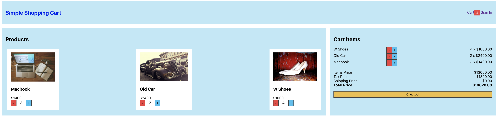
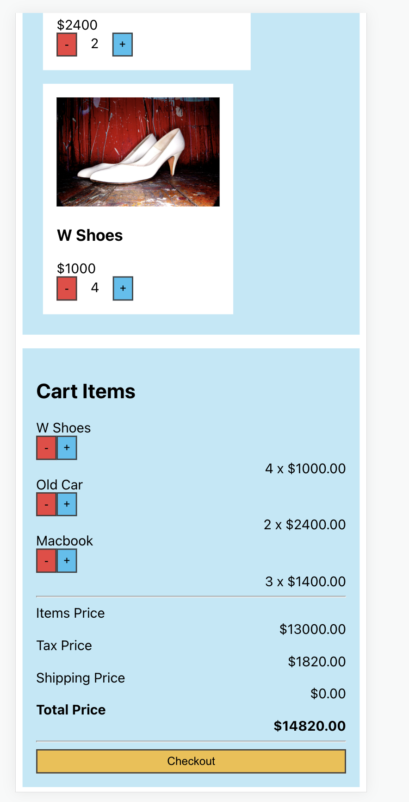
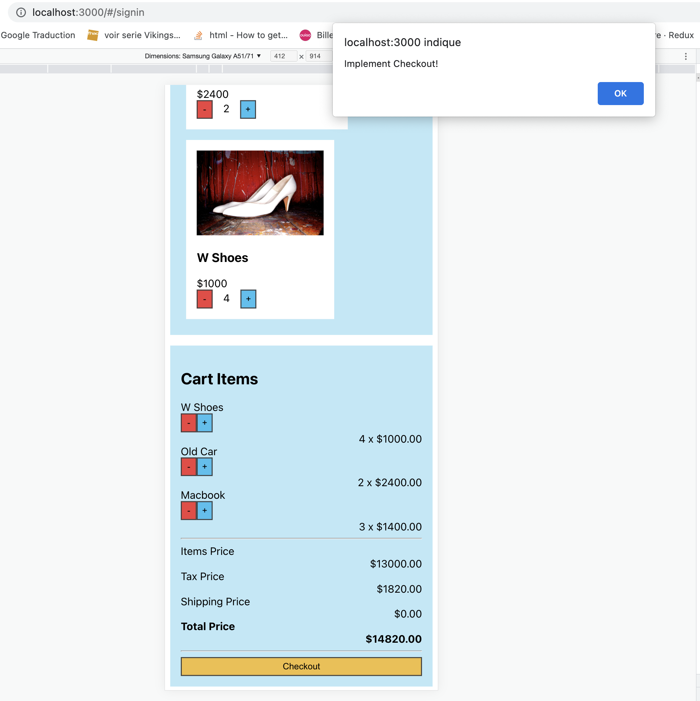

# Simple Shopping Cart

## Lessons

1. create react app
    npx create-react-pp
    remove extra files
2. create website layout
    add Header, Main and Basket component
    Style component
3. create Main component
    create data.js
    render product items
4. create Product component
    create product divs
    pass props to product component
5. Implement cart
    add and remove items from the cart
6. create basket component
    list items in cartItems
    calculate sub total
    show checkout button
7. save cart items in local storage
    save items in local storage on add and remove
    use useEffect to get items in local storage
8 use useTransition and useDeferedValue
    read items in local storage using useTransition
    change cartItems.length to transition effect

## Screen Shot

